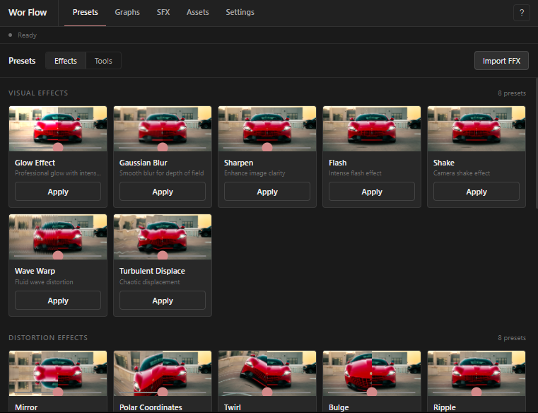

# Wor Flow

AE panel for one-click effects, graph curves, SFX, and local assets—without leaving your workspace.



## Try it

1. Install the extension (see below).
2. Go to **C:\Program Files (x86)\Common Files\Adobe\CEP\extensions**.

The panel runs inside AE only.

## Quick start

```text
Copy this folder → Adobe CEP extensions directory
Restart After Effects → Window → Extensions → Wor Flow
Select a layer → click Apply on any preset
```

## Features

- **Tools** — Layer shortcuts (pre-compose, nulls, time remapping, speed, trim comp, and more)
- **Graphs** — Apply easing curves to selected keyframes (ease, expo, speed ramp, etc.)
- **SFX** — Browse bundled sound categories and import into the project
- **Assets** — Drop or browse media into `Documents/WorFlow` and import from the panel
- **Settings** — Accent color, UI speed, export/import preferences

## Install

**Requirements:** After Effects 2023+ (manifest AEFT 23.0), CEP 5.

**Windows (typical):**

```text
C:\Program Files (x86)\Common Files\Adobe\CEP\extensions\WorFlow
```

Copy the full extension folder:

**Unsigned extensions:** Enable CEP debug mode if the panel does not appear ([Adobe CEP cookbooks](https://github.com/Adobe-CEP/CEP-Resources)).

User data (presets, assets, preferences) is created on demand under:

```text
~/Documents/WorFlow
``